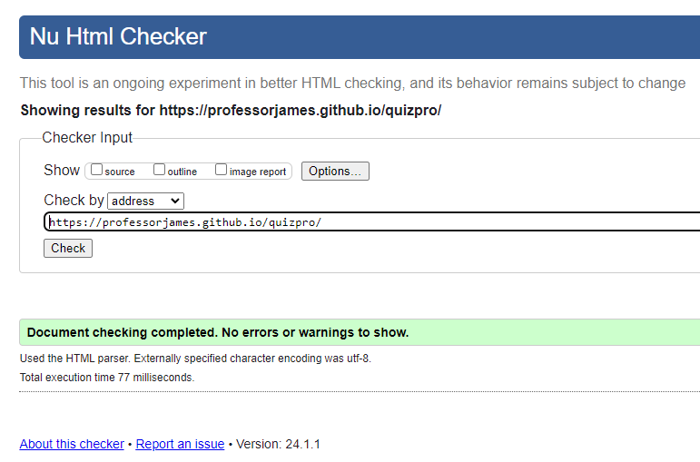
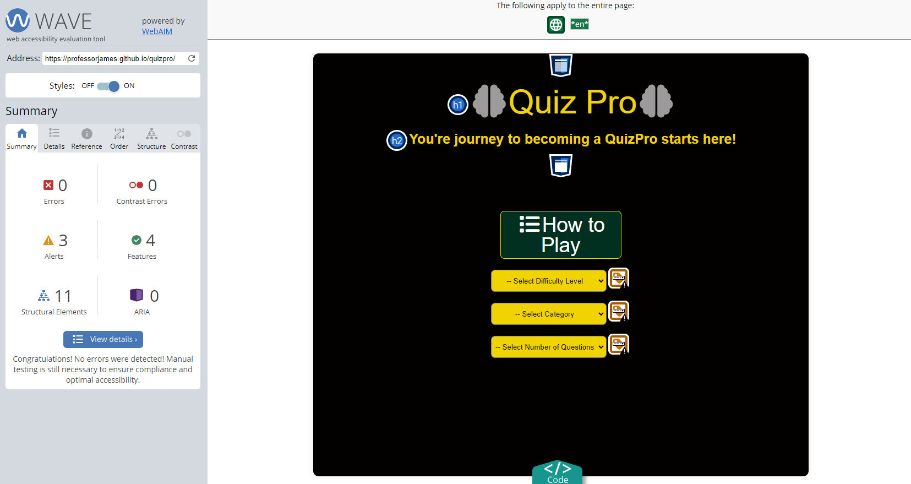
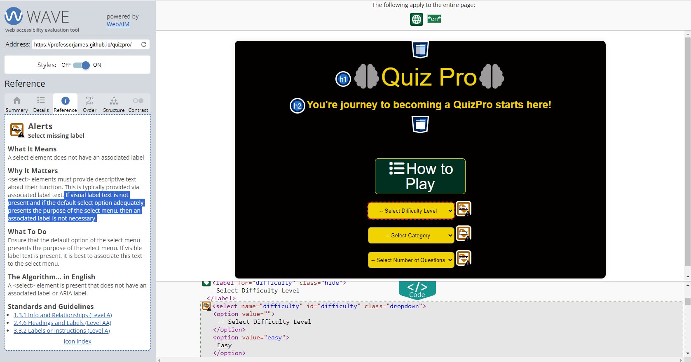

# [QuizPro](https://professorjames.github.io/quizpro/ 'QuizPro')

## Goal for this Project

Welcome to QuizPro: Your Ultimate Quiz Experience!

The primary goal of QuizPro is to create a user-friendly, feature-rich, and versatile quiz application that provides an engaging and educational experience for both quiz creators and quiz takers.

## Table of Contents

- [QuizPro](#QuizPro)
  - [Goal for this Project](#goal-for-this-project)
  - [Table of Contents](#table-of-contents)
- [UX](#ux)
  - [User Goals](#user-goals)
  - [User Stories](#user-stories)
  - [Site Owner Goals](#site-owner-goals)
    - [Requirements](#requirements)
    - [Expectations](#expectations)
  - [Design Choices](#design-choices)
    - [Fonts](#fonts)
    - [Colours](#colours)
    - [Icons](#icons)
    - [Structure](#structure)
- [Features](#features)
  - [Landing Page](#landing-page)
  - [Features to be Implemented](#features-to-be-implemented)
- [Technologies used](#technologies-used)
  - [Languages](#languages)
  - [Libraries and Frameworks](#libraries-and-frameworks)
  - [Tools](#tools)
- [Testing](#testing)
  - [Bugs](#bugs)
  - [Unfixed-Bugs](#unfixed-bugs)
- [Deployment](#deployment)
- [Credits](#credits)

# UX

## User Goals

## User Stories

## Site Owner Goals

## Design Choices

### Requirements

### Expectations

\
&nbsp;
[Back to top](#table-of-contents)
\
&nbsp;

### Fonts

In this project, the user interface has been enriched by incorporating icons sourced from [Font Awesome](https://fontawesome.com/ 'Font Awesome'), a widely-used icon library.

### Colours

The colour pallette was generated using [Coolors](https://coolors.co/ 'Coolors').

| CSS Variable Name | Hex Code  | Comment                                                                                                                  |
| ----------------- | --------- | ------------------------------------------------------------------------------------------------------------------------ |
| black             | `#020100` | Used as a background colour for website. Also used as a text colour in some sections.                                    |
| eerie-black       | `#1A1B1D` |                                                                                                                          |
| gunmetal          | `#262C35` |                                                                                                                          |
| rich-black        | `#0D1321` |                                                                                                                          |
| yellow            | `#F1D302` | Used to style h1 text, fontawesome icons, selected answers radio buttons                                                 |
| dark-green        | `#023020` | Used to style body element when user selects a correct answer. Also used to style text of number of Correct Scores.      |
| red               | `#C1292E` | Used to style body element when user selects an incorrect answer. Also used to style text of number of Incorrect Scores. |
| white             | `#FFF`    |                                                                                                                          |

### Icons

### Structure

This project follows a mobile-first design approach, with a focus on ensuring that the website looks and functions well on smaller screens. The primary reference point for styling is the Iphone SE, with a screen width of 375px.

To create a responsive design that adapts to various screen sizes, we use breakpoints inspired by Bootstrap. These breakpoints help us optimize the layout and styling of our website for different devices and screen widths.
You can find more information about Bootstrap breakpoints in their official documentation [Bootstrap breakpoints](https://getbootstrap.com/docs/5.0/layout/breakpoints/ 'Bootstrap').

| Screen Size | Breakpoint |
| ----------- | ---------- |
| x-small     | <576px     |
| small       | => 576px   |
| medium      | => 768px   |
| large       | => 992px   |
| x-large     | => 1200px  |

\
&nbsp;
[Back to top](#table-of-contents)
\
&nbsp;

# Technologies used

## Languages

- [HTML](https://developer.mozilla.org/en-US/docs/Web/HTML 'HTML')

- [CSS](https://developer.mozilla.org/en-US/docs/Web/CSS 'CSS')

- [JavaScript](https://developer.mozilla.org/en-US/docs/Web/JavaScript 'JS')

## Libraries and Frameworks

- [Google Fonts](https://fonts.google.com/ 'Google Fonts')
- [Font Awesome](https://fontawesome.com/search 'Font Awesome')

## Tools

- [Visual Studio Code](https://code.visualstudio.com/ 'Visual Studio Code')
- [W3C HTML Validation Service](https://validator.w3.org/ 'W3C HTML')
- [W3C CSS Validation Service](https://jigsaw.w3.org/css-validator/ 'W3C CSS')
- [WAVE](https://wave.webaim.org/ 'WAVE')
- [Coolors](https://coolors.co/ 'Coolors')
- [AmIResponsive](https://ui.dev/amiresponsive/ 'AmIResponsive')
- [Tables Generator](https://www.tablesgenerator.com/markdown_tables 'Markdown Tables Generator')

\
&nbsp;
[Back to top](#table-of-contents)
\
&nbsp;

# Testing

Testing was essential to ensure the website functions correctly and meets the desired user experience. The following testing was conducted throughout the development of the website:

2. Content

- Text Content: Reviewed all text content for accuracy, grammar, and spelling.

- Icons: Ensured that icons correctly and display as intended.

3. Functionality

-
-

4. Responsive Design

- Mobile Devices: Tested the website on various mobile devices (e.g., Iphone SE, smartphones and tablets) to ensure that it is responsive and adapts well to different screen sizes.

- Desktop: Tested the website on large screen sizes to ensure that it is responsive and adapts well to different screen sizes.

5. Cross-Device Testing

- Tested the website on various devices and screen sizes to ensure a consistent and user-friendly experience across platforms.

- Browser Compatibility: Verified that the website functions correctly on different web browsers (Chrome, Edge & Firefox) to ensure cross-browser compatibility.

6. Validation

- Each line of code been meticulously reviewed. Below are the results of validation testing completed.

(i) HTML (index.html) validator results

(ii) CSS (style.css) validator results

7. Performance & Accessibility Best Practices

## Bugs

1. Category list of options - when dynamically generating the dropdown list of category options these were too long and going off the page.

TODO. FIX

2. Questions and Answers not displaying some characters correctly, such as commas' and appostrophes.
   Used 'innerHTMl' to display text instead of 'textContent' to solve issue.

3. When a user submits a question the getSubmittedAnswer function is not correctly returning the text of the answer to be used for comparison. This is causing a correctly selected answer to be marked as incorrect. Also correct counter doesn't increment.

TODO. FIX.

## Improvements / Unfixed-Bugs

1. Handling of asynchronous requests: Could possibly use thenables instead of async/await functions to retrieve information from API. This should reduce time for First Contentful Paint. Otherwise, performance stats are quite good as per Lighthoue reports so maybe this is not an issue.

2. Could possibly refactor answerCorrect and answerIncoorect into one function as these functions do similar things.

3. Accessibility stats: Lighthouse and Wave reports are showing that 'Select elements do not have associated label elements.'

Reading through the Wave alerts information it states that "If visual label text is not present and if the default select option adequately presents the purpose of the select menu, then an associated label is not necessary."

The default select options adequately present the purpose of the select menus, and their purpose is also covered in the instructions in the 'How to Play' modal, so i believe this the code meest teh requiremenst outlined by Wave above.

# Deployment

After writing and committing the code to GitHub, the project was deployed using the following GitHub deployment steps:

- Go to the GitHub repository and click on the 'Settings' tab.
- In the side navigation menu, choose 'Pages.'
- Under the 'Source' section, click on the dropdown menu labeled 'None' and select 'main'
- Click the 'Save' button to confirm your selection.
- The website is now live at <https://professorjames.github.io/quizpro/>.

\
&nbsp;
[Back to Top](#table-of-contents)
\
&nbsp;
