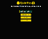
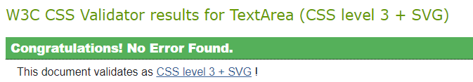
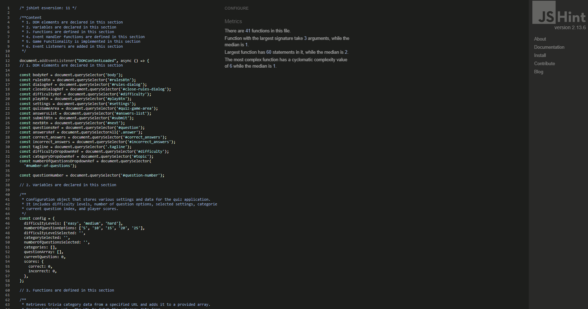
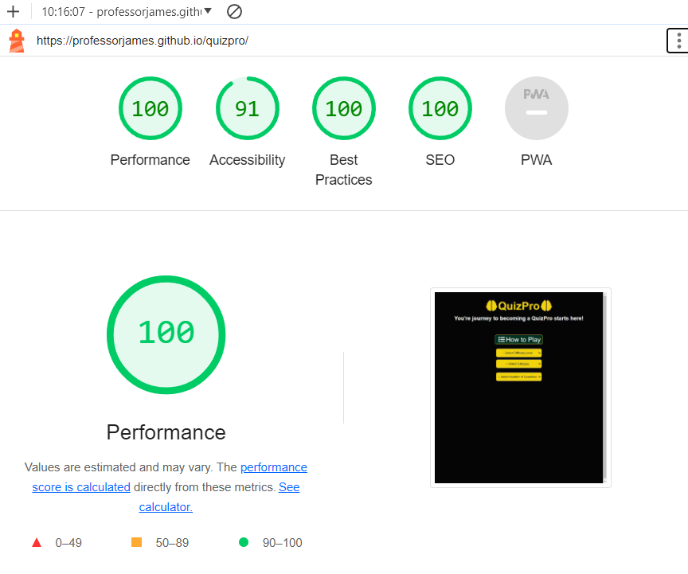
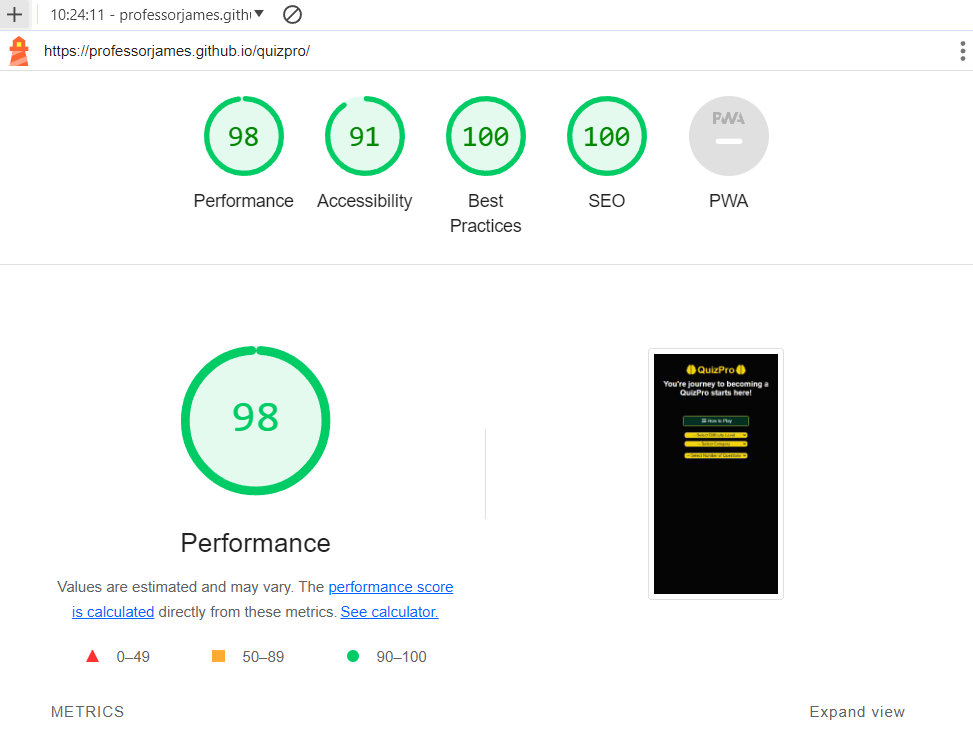

# QuizPro

### Deployed website [QuizPro](https://professorjames.github.io/quizpro/ 'QuizPro')

## Goal for this Project
Welcome to QuizPro: Your Ultimate Quiz Experience!

The primary goal of QuizPro is to create a user-friendly, feature-rich, and versatile quiz application that provides an engaging and educational experience for both quiz creators and quiz takers.

Users are able to generate quizzes with different difficult levels, topics and  number of questions. 

## Table of Contents

- [UX](#ux)
  - [User Stories](#user-stories)
- [Design Choices](#design-choices)
    - [Fonts](#fonts)
    - [Icons](#icons)
    - [Colours](#colours)
    - [Structure](#structure)
    - [Wireframes](#wireframes)
- [Features](#features)
  - [General Feature](#general-features)
  - [Features to be Implemented](#features-to-be-implemented)
- [Technologies used](#technologies-used)
  - [Languages](#languages)
  - [Libraries and Frameworks](#libraries-and-frameworks)
  - [Tools](#tools)
- [Testing](#testing)
  - [Bugs](#bugs)
  - [Unfixed-Bugs](#unfixed-Bugs)
- [Deployment](#deployment)
- [Credits](#credits)

# UX

## User Stories

-	As a user, I want the website to be fully responsive and adapt to my device for a seamless experience.
-	As a user, I want easy navigation while using this website.
-	As a user, I want easy access to information on how to play the quiz.
-	As a user, I want the ability to choose various difficulty levels.
-	As a user, I want the ability to choose from various question categories. 
-	As a user, I want the ability to choose various amounts of questions.
-	As a user, I want immediate feedback to confirm whether my answer was correct or not.
-	As a user, I want to keep track of the number of questions I answered correctly and incorrectly.
-	As a user, I want to know my score at the end of the quiz
-	As a user, I want to receive feedback at the end of the quiz

\
&nbsp;
[Back to top](#table-of-contents)
\
&nbsp;

## Design Choices

### Fonts
To enhance typography, [Google Fonts](https://fonts.google.com/ "Google Fonts") were employed.
[Roboto](https://fonts.google.com/specimen/Roboto?query=robo "Roboto") was selected for text throughout the site.

### Icons

In this project, the user interface has been enriched by incorporating icons sourced from [Font Awesome](https://fontawesome.com/ 'Font Awesome'), a widely-used icon library.

### Colours

The colour pallette was generated using [Coolors](https://coolors.co/ 'Coolors').

| CSS Variable Name | Hex Code  | Comment                                                                                                                  |
| ----------------- | --------- | ------------------------------------------------------------------------------------------------------------------------ |
| black             | `#050505` | Used as a background colour for website. Also used as a text colour in some sections.                                    |
| school-bus-yellow            | `#F1D302` | Used to style h1 text, radio buttons when checked, answers when hovered, fontawesome icons, selected answers radio buttons                                                 |
| dark-green        | `#023020` | Used as background color for 'How to Play', 'Start Quiz', 'Submit Answer' and 'Play Again' buttons. Also used for backgroundcolor of modal header text.      |
| light-green        | `#1EAA38` | Used to style body element when user selects a correct answer. Also used to style text of number of Correct Scores.      |
| fire-engine-red               | `#C1292E` | Used to style body element when user selects an incorrect answer. Also used to style text of number of Incorrect Scores. |
| light-gray               | `#9c9a9a` | Used to style question text and as a background color for 'Close' button in modal |
| white             | `#FFF`    |      Used to style some text |

### Structure

This project follows a mobile-first design approach, with a focus on ensuring that the website looks and functions well on smaller screens. The primary reference point for styling is the Iphone SE, with a screen width of 375px.

To create a responsive design that adapts to various screen sizes, we use breakpoints inspired by Bootstrap. These breakpoints help us optimize the layout and styling of our website for different devices and screen widths.
You can find more information about Bootstrap breakpoints in their official documentation [Bootstrap breakpoints](https://getbootstrap.com/docs/5.0/layout/breakpoints/ 'Bootstrap').

| Screen Size | Breakpoint |
| ----------- | ---------- |
| x-small     | <576px     |
| small       | => 576px   |
| medium      | => 768px   |
| large       | => 992px   |
| x-large     | => 1200px  |

### Wireframes
The wireframes were created using [Microsoft Powerpoint](https://www.microsoft.com/en-ie/microsoft-365/powerpoint)

 
Desktop

 Home Page

  
  How to Play Modal 

  Start Quiz

## Answers
  Select Answer

  Answer Selected

  Incorrect Answer

  Correct Answer

  ## End of Game Messages
  End of Game Message 1

  End of Game Message 2

  End of Game Message 3

  End of Game Message 4

  End of Game Message 5

 
Mobile

 Mobile Wireframes

\
&nbsp;
[Back to top](#table-of-contents)
\
&nbsp;

# Features

### General Features
- The site is designed as a single page application.

- The site is fully responsive and has been tested using a number of screen sizes.

### Favicon: 
- The site has a favicon.

### Home Page: 

  - When the user first visits the site this is the screen they see.

  
  
### How to Play Modal:
  - When the user clicks on the 'How to Play' button a modal appears. 
  - The modal has details of how to play the quiz. 

    

### Select Game Options:

- The user can select a difficulty level, category and number of questions using the dropdown menus.

#### Difficulty Dropdown menu

#### Categories Dropdown menu

#### Number of Questions Dropdown menu

### Start game:

- When all dropdown menus have been select the 'Start Quiz' button appears

### Playing the Game:

#### Question and Answers: 
- Once the user starts the quiz a page is displayed showing the question and 4 possible answers.

#### Select Answer: 
- When the user clicks on an answer the radio button turns yellow. The user can then submit their answer by pressing the 'Submit Answer' button.

#### Correct Answer:
- If the user answered the question correctly the background color of the body element turns lightgreen in colour. 
- The 'Correct' counter also increments by one.
- The user can press the 'Next >>' button to move to the next question.

#### Incorrect Answer:
 
- If the user answered the question incorrectly the background color of the body element turns red in colour. The 'Incorrect' counter also increments by one.
- The user can press the 'Next >>' button to move to the next question.

### End of Game:

- The game finishes when the user has answered all questions.
- The end of game message tells user how many questions they answered correctly and offers encoragement.
- The end of game message displayed depends on the score the user gets 

1. Score < 25%

2. Score between 25% and 50% 

3. Score between 50% and 75% 

4. Score between 75% and 90%

5. All question answered correctly 

- The user has the ability to start another quiz when the game is over by clicking the 'Play Again' button. This brings them back to the 'Home' page screen.

## Features Video

Download the features video and watch for site walkthrough

## Features to be Implemented

- Add a backend and authentication so that users can register for the site, log in and log out of the site. 
- Add a leaderboard so that users can keep track of their scores.
- Add a recommendation system so that users can receive feedback on areas and topics that they can improve most in.
- Add a head to head option so that players can play against friends.
- Make own API rather than relying on a third party API provider
- Add more questions to own quiz database to address issues when existing API.

# Technologies used

## Languages

- [HTML](https://developer.mozilla.org/en-US/docs/Web/HTML 'HTML')

- [CSS](https://developer.mozilla.org/en-US/docs/Web/CSS 'CSS')

- [JavaScript](https://developer.mozilla.org/en-US/docs/Web/JavaScript 'JS')

## Libraries and Frameworks

- [Google Fonts](https://fonts.google.com/ 'Google Fonts')
- [Font Awesome](https://fontawesome.com/search 'Font Awesome')

## Tools

- [Microsoft Powerpoint](https://www.microsoft.com/en-ie/microsoft-365/powerpoint 'Mocrosfot Powerpoint')
- [Visual Studio Code](https://code.visualstudio.com/ 'Visual Studio Code')
- [Git](https://git-scm.com/)
- [GitHub](https://github.com/)
- [GitHub Pages](https://pages.github.com/)
- [favicon.io](https://favicon.io// 'Favicon Generator')
- [W3C HTML Validation Service](https://validator.w3.org/ 'W3C HTML')
- [W3C CSS Validation Service](https://jigsaw.w3.org/css-validator/ 'W3C CSS')
- [JSHint](https://jshint.com/ 'JS Hint')
- [WAVE](https://wave.webaim.org/ 'WAVE')
- [Coolors](https://coolors.co/ 'Coolors')
- [AmIResponsive](https://ui.dev/amiresponsive/ 'AmIResponsive')
- [Tables Generator](https://www.tablesgenerator.com/markdown_tables 'Markdown Tables Generator')
- [Zamzar](https://www.zamzar.com/ 'ZAMZAR')
- [Compress2Go](https://www.compress2go.com/ 'Compress2Go')

\
&nbsp;
[Back to top](#table-of-contents)
\
&nbsp;

# Testing

Testing was essential to ensure the website functions correctly and meets the desired user experience. The following testing was conducted throughout the development of the website:

1. Testing User Stories

| User Stories                                                                                           | Achieved By                                                                                                                                                           | Test Status |
|--------------------------------------------------------------------------------------------------------|-----------------------------------------------------------------------------------------------------------------------------------------------------------------------|-------------|
| As a user, I want the website to be fully responsive and adapt to my device for a seamless experience. | The website was developed to be fully responsive and using a mobile first approach. This ensures the website renders correctly for desktop, tablet and mobile devices | Pass        |
| As a user, I want easy navigation while using this website.                                            | The website was developed as a Single Page Application. All buttons were tested and functioning correctly                                                            | Pass        |
| As a user, I want easy access to information on how to play the quiz.                                  | The website includes a 'How to Play' button that when clicked opens a modal with clear instructions on how to play the game.                                           | Pass        |
| As a user, I want the ability to choose various difficulty levels.                                     | The user can select from three different difficulty levels of questions: 'Easy', 'Medium' or 'Hard', using a dropdown menu.                                                | Pass        |
| As a user, I want the ability to choose from various question categories.                              | The user can select from various categories of questions using a dropdown menu.                                                                                            | Pass        |
| As a user, I want the ability to choose various amounts of questions.                                  | The user can select various numbers of questions using a dropdown menu.                                                                                               | Pass        |
| As a user, I want immediate feedback to confirm whether my answer was correct or not.                  | The body background colour changes colour depending on whether the user answers a question correctly ('light-green') or incorrectly ('fire-engine-red').              | Pass        |
| As a user, I want to keep track of the number of questions I answered correctly and incorrectly.       | There are counters that tell the user how many questions they have answered correctly and incorrectly.                                                                | Pass        |
| As a user, I want to know my score at the end of the quiz                                              | The end of game message tells the user how many questions they answered correctly.                                                                                     | Pass        |
| As a user, I want to receive feedback at the end of the quiz                                           | The end of game message tells the user how they did overall and offers encoutragement depending on their score.                                                       | Pass        |

\
&nbsp;
[Back to top](#table-of-contents)
\
&nbsp;

2. Content

- Text Content: Reviewed all text content for accuracy, grammar, and spelling.

- Icons: Ensured that icons load correctly and display as intended.

3. Responsive Design

- Mobile Devices: Tested the website on various mobile devices (e.g., Iphone SE, smartphones and tablets) to ensure that it is responsive and adapts well to different screen sizes.

- Desktop: Tested the website on large screen sizes to ensure that it is responsive and adapts well to different screen sizes.

4. Cross-Device Testing

- Tested the website on various devices and screen sizes to ensure a consistent and user-friendly experience across platforms.

- Browser Compatibility: Verified that the website functions correctly on different web browsers (Chrome, Edge & Firefox) to ensure cross-browser compatibility.

\
&nbsp;
[Back to top](#table-of-contents)
\
&nbsp;

## Automated Testing

### W3C Markup Validation Service
- No errors or warnings showing for HTML (index.html) validator results from W3C Markup Validation Service.

[Quiz Pro W3C Markup Validation Service
results](https://validator.w3.org/nu/?doc=https%3A%2F%2Fprofessorjames.github.io%2Fquizpro%2F/ 'Quiz Pro W3C Markup Validation Service')

### W3C CSS Validation Service
- No errors or warnings showing for CSS (style.css) validator results from W3C CSS Validation Service.

The attached pdf contains the CSS code that was tested and the results.
[CSS Validator](docs/validation/w3-css-validator-results-for-style.css-%20(css-level-3+svg).pdf)

(iii) JavaScript (script.js) validator results

### Lighthouse

- Google Chromes Developer Tools Lighhouse was used to test Perfromance, Accessibility, Best Practices and SEO.

- Desktop

- Mobile

\
&nbsp;
[Back to top](#table-of-contents)
\
&nbsp;

## Bugs

1. Category list of options:
- When dynamically generating the dropdown list of category options these appeared to be too long and going off the page on mobile screens using Chrome Developer tools.

- Solution: This appears to be a 'ghost' error. The dropdown menu when deployed and tested on actual mobile devices is working fine.

2. Questions and Answers text:
- The Questions and Answer text was not displaying some characters correctly, such as commas' and appostrophes.
   
- Solution: Used 'innerHTMl' to display text instead of 'textContent' to solve issue.

3. getSubmittedAnswer function:
- When a user submits a question the getSubmittedAnswer function is not correctly returning the text of the answer to be used for comparison. This is causing a correctly selected answer to be marked as incorrect. Also correct counter doesn't increment.

- Solution: Code was refactored to address error and ensure that the function is working as expected.

## Improvements / Unfixed-Bugs

1. Handling of asynchronous requests: Could possibly use thenables instead of async/await functions to retrieve information from API. This should reduce time for First Contentful Paint. Otherwise, performance stats are quite good as per Lighthoue reports so maybe this is not an issue.

2. Could possibly refactor answerCorrect and answerIncorrect into one function as these functions do similar things.

3. Accessibility stats: Lighthouse and Wave reports are showing that 'Select elements do not have associated label elements.'

Reading through the Wave alerts information it states that "If visual label text is not present and if the default select option adequately presents the purpose of the select menu, then an associated label is not necessary."

The default select options adequately represent the purpose of the select menus, and their purpose is also covered in the instructions in the 'How to Play' modal, so I believe the code meets the requiremenst outlined by Wave above.

4. Unavailable quizzes:
  While testing the site we noted that some combinations of selected questions are unavailable from the API. For example, if a player selects 'Hard', 'Entertainment: Cartoons & Animation' and more than 15 questions this wiil throw an error. The reason being there are not more than 15 questions of this type in the Open Trivi DB API. Try and catch blocks have been used within the code to manage these scenarios. The user is prompted to try a different combination and try again. This approach was chosen rather than reducing the number of questions a player can select.

\
&nbsp;
[Back to top](#table-of-contents)
\
&nbsp;

# Deployment

## Deploying Project 
After writing and committing the code to GitHub, the project was deployed using the following GitHub deployment steps:

- Go to the GitHub repository and click on the 'Settings' tab.
- In the side navigation menu, choose 'Pages.'
- Under the 'Source' section, click on the dropdown menu labeled 'None' and select 'main'
- Click the 'Save' button to confirm your selection.
- The website is now live at <https://professorjames.github.io/quizpro/>.

## Forking Project
Forking a GitHub repository allows you to create your own copy of a repository in your GitHub account. This copy can be modified independently without affecting the original repository.

- To fork a project, follow these steps:
- Sign in to your GitHub account.
- Locate the repository you wish to duplicate.
- Click to access the repository.
- On the right hand side of the repository's menu, you'll see the 'Fork' button.
- Simply click the 'Fork' button to create a copy of the repository within your GitHub account."

## Cloning Project
Follow the below steps to clone the repository to your local machine.

- Log in to your GitHub account if you're not already logged in.
- Go to the main page of the repository you want to clone.
- Click on the "Code" button. 
- Click the clipboard icon next to the repository URL to copy it.
- Launch your system's IDE, terminal or command prompt.
- Use the 'cd' command to navigate to the directory where you want to store the cloned repository.
 `cd /path/to/your/desired/directory`
- Type the following command, replacing `<repository-url>` with the URL you copied earlier:
 `git clone <repository-url>`

# Credits

For guidance, advice, motivation, and inspiration:

[Simen Daehlin](https://github.com/Eventyret "Simen Daehlin") has been incredibly supportive, helping me learn and develop while also presenting me with challenging opportunities. I'm grateful for his guidance, and I look forward to continuing to learn under his mentorship. Thanks Simen.

\
&nbsp;
[Back to Top](#table-of-contents)
\
&nbsp;