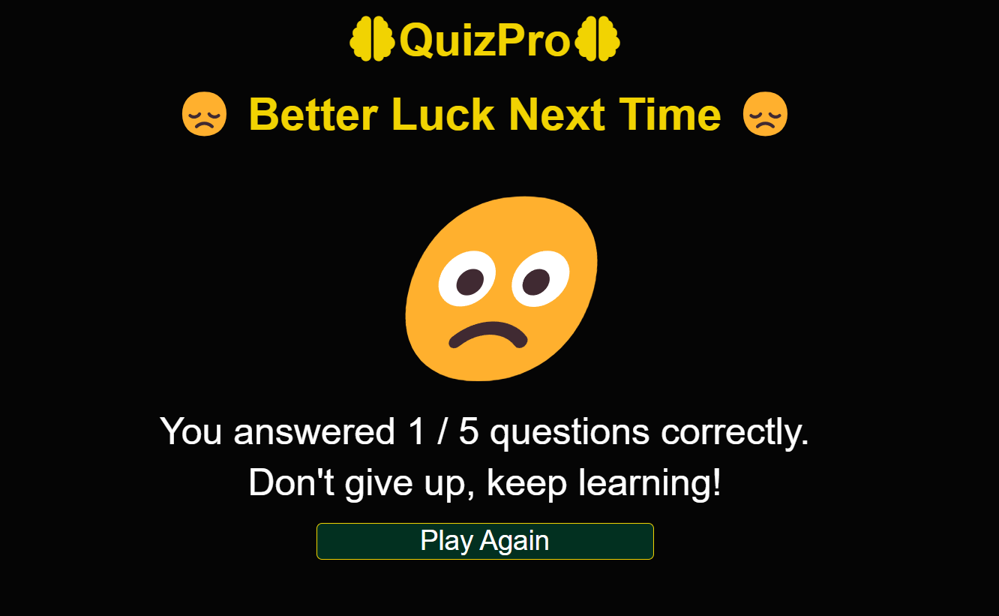
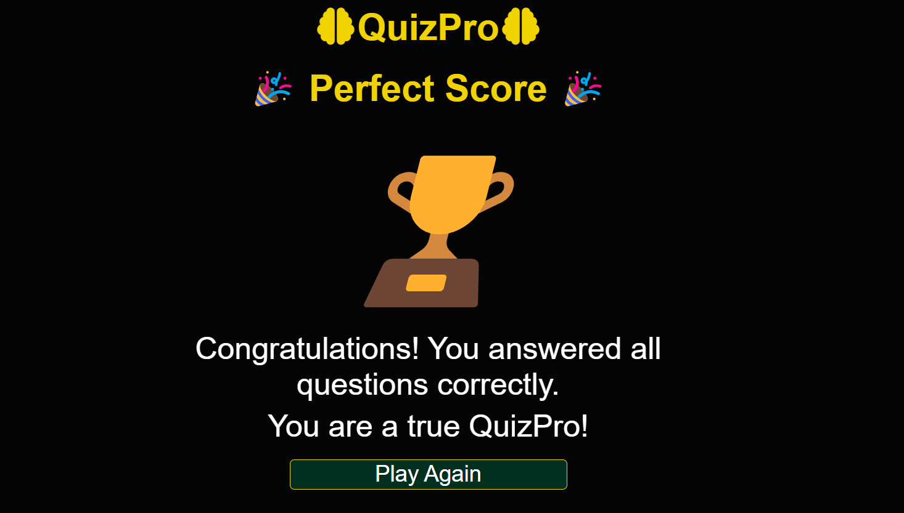

# QuizPro

### Deployed website [QuizPro](https://professorjames.github.io/quizpro/ 'QuizPro')

## Goal for this Project
Welcome to QuizPro: Your Ultimate Quiz Experience!

The primary goal of QuizPro is to create a user-friendly, feature-rich, and versatile quiz application that provides an engaging and educational experience for both quiz creators and quiz takers.

Users are able to generate quizzes with different difficult levels, topics and  number of questions. 

## Table of Contents

- [UX](#ux)
  - [User Stories](#user-stories)
- [Design Choices](#design-choices)
    - [Fonts](#fonts)
    - [Icons](#icons)
    - [Colours](#colours)
    - [Structure](#structure)
    - [Wireframes](#wireframes)
- [Features](#features)
  - [General Feature](#general-features)
  - [Features to be Implemented](#features-to-be-implemented)
- [Technologies used](#technologies-used)
  - [Languages](#languages)
  - [Libraries and Frameworks](#libraries-and-frameworks)
  - [Tools](#tools)
- [Testing](#testing)
  - [Bugs](#bugs)
  - [Unfixed-Bugs](#unfixed-bugs)
- [Deployment](#deployment)
- [Credits](#credits)

# UX

## User Stories

-	As a user, I want the website to be fully responsive and adapt to my device for a seamless experience.
-	As a user, I want easy navigation while using this website.
-	As a user, I want easy access to information on how to play the quiz.
-	As a user, I want the ability to choose various difficulty levels.
-	As a user, I want the ability to choose from various question categories. 
-	As a user, I want the ability to choose various amounts of questions.
-	As a user, I want immediate feedback to confirm whether my answer was correct or not.
-	As a user, I want to keep track of the number of questions I answered correctly and incorrectly.
-	As a user, I want to know my score at the end of the quiz
-	As a user, I want to receive feedback at the end of the quiz

\
&nbsp;
[Back to top](#table-of-contents)
\
&nbsp;

## Design Choices

### Fonts
To enhance typography, [Google Fonts](https://fonts.google.com/ "Google Fonts") were employed.
[Roboto](https://fonts.google.com/specimen/Roboto?query=robo "Roboto") was selected for text throughout the site.

### Icons

In this project, the user interface has been enriched by incorporating icons sourced from [Font Awesome](https://fontawesome.com/ 'Font Awesome'), a widely-used icon library.

### Colours

The colour pallette was generated using [Coolors](https://coolors.co/ 'Coolors').

| CSS Variable Name | Hex Code  | Comment                                                                                                                  |
| ----------------- | --------- | ------------------------------------------------------------------------------------------------------------------------ |
| black             | `#050505` | Used as a background colour for website. Also used as a text colour in some sections.                                    |
| school-bus-yellow            | `#F1D302` | Used to style h1 text, radio buttons when checked, answers when hovered, fontawesome icons, selected answers radio buttons                                                 |
| dark-green        | `#023020` | Used as background color for 'How to Play', 'Start Quiz', 'Submit Answer' and 'Play Again' buttons. Also used for backgroundcolor of modal header text.      |
| light-green        | `#1EAA38` | Used to style body element when user selects a correct answer. Also used to style text of number of Correct Scores.      |
| fire-engine-red               | `#C1292E` | Used to style body element when user selects an incorrect answer. Also used to style text of number of Incorrect Scores. |
| light-gray               | `#9c9a9a` | Used to style question text and as a background color for 'Close' button in modal |
| white             | `#FFF`    |      Used to style some text |

### Structure

This project follows a mobile-first design approach, with a focus on ensuring that the website looks and functions well on smaller screens. The primary reference point for styling is the Iphone SE, with a screen width of 375px.

To create a responsive design that adapts to various screen sizes, we use breakpoints inspired by Bootstrap. These breakpoints help us optimize the layout and styling of our website for different devices and screen widths.
You can find more information about Bootstrap breakpoints in their official documentation [Bootstrap breakpoints](https://getbootstrap.com/docs/5.0/layout/breakpoints/ 'Bootstrap').

| Screen Size | Breakpoint |
| ----------- | ---------- |
| x-small     | <576px     |
| small       | => 576px   |
| medium      | => 768px   |
| large       | => 992px   |
| x-large     | => 1200px  |

### Wireframes
The wireframes were created using [Microsoft Powerpoint](https://www.microsoft.com/en-ie/microsoft-365/powerpoint)
The wireframes were created using [Microsoft Powerpoint](https://www.microsoft.com/en-ie/microsoft-3Iconswericons)

 
Desktop

 Home Page

  
  How to Play Modal 

  Start Quiz

## Answers
  Select Answer

  Answer Selected

  Incorrect Answer

  Correct Answer

  ## End of Game Messages
  End of Game Message 1

  End of Game Message 2

  End of Game Message 3

  End of Game Message 4

  End of Game Message 5

 
Mobile

 Mobile Wireframes

\
&nbsp;
[Back to top](#table-of-contents)
\
&nbsp;

# Features

## General Features
- The site is designed as a sinlge page application.

- The site is fully responsive and has been tested using a number of screen sizes.

Favicon: 
- The site has a favicon

  Home Page: 

  - When the user first visits the site this is the view they see.

  
  
  How to Play Modal:
  - When the user clicks on the 'How to Play' button a modal appears. 
  - The modal has details of how to play the quiz. 

    

Select Game Options:

- The user can select a difficulty level, category and number of questions using the dropdown menus.

    
    

    

    

Start game:

- When all options have been select the 'Start Quiz' button appears

Playing the Game:

- Question and Answers

- Select Answer

- Correct Answer

- Incorrect Answer

End of Game:

- The game finishes when the user has answered all questions.
- The end of game mesaage displayed depends on the score the user gets
- The user has the ability to start another quiz when the gane is over by clicking the 'Play Again' button

1. Score < 25%

2. Score between 25% and 50% 

3. Score between 50% and 75% 

4. Score between 75% and 90%

5. All question answered correctly 

## Features Video

## Features to be Implemented

# Technologies used

## Languages

- [HTML](https://developer.mozilla.org/en-US/docs/Web/HTML 'HTML')

- [CSS](https://developer.mozilla.org/en-US/docs/Web/CSS 'CSS')

- [JavaScript](https://developer.mozilla.org/en-US/docs/Web/JavaScript 'JS')

## Libraries and Frameworks

- [Google Fonts](https://fonts.google.com/ 'Google Fonts')
- [Font Awesome](https://fontawesome.com/search 'Font Awesome')

## Tools

- [Visual Studio Code](https://code.visualstudio.com/ 'Visual Studio Code')
- [W3C HTML Validation Service](https://validator.w3.org/ 'W3C HTML')
- [W3C CSS Validation Service](https://jigsaw.w3.org/css-validator/ 'W3C CSS')
- [WAVE](https://wave.webaim.org/ 'WAVE')
- [Coolors](https://coolors.co/ 'Coolors')
- [AmIResponsive](https://ui.dev/amiresponsive/ 'AmIResponsive')
- [Tables Generator](https://www.tablesgenerator.com/markdown_tables 'Markdown Tables Generator')

\
&nbsp;
[Back to top](#table-of-contents)
\
&nbsp;

# Testing

Testing was essential to ensure the website functions correctly and meets the desired user experience. The following testing was conducted throughout the development of the website:

2. Content

- Text Content: Reviewed all text content for accuracy, grammar, and spelling.

- Icons: Ensured that icons correctly and display as intended.

3. Functionality

-
-

4. Responsive Design

- Mobile Devices: Tested the website on various mobile devices (e.g., Iphone SE, smartphones and tablets) to ensure that it is responsive and adapts well to different screen sizes.

- Desktop: Tested the website on large screen sizes to ensure that it is responsive and adapts well to different screen sizes.

5. Cross-Device Testing

- Tested the website on various devices and screen sizes to ensure a consistent and user-friendly experience across platforms.

- Browser Compatibility: Verified that the website functions correctly on different web browsers (Chrome, Edge & Firefox) to ensure cross-browser compatibility.

6. Validation

- Each line of code been meticulously reviewed. Below are the results of validation testing completed.

(i) HTML (index.html) validator results

(ii) CSS (style.css) validator results

7. Performance & Accessibility Best Practices

## Bugs

1. Category list of options - when dynamically generating the dropdown list of category options these were too long and going off the page.

TODO. FIX

2. Questions and Answers not displaying some characters correctly, such as commas' and appostrophes.
   Used 'innerHTMl' to display text instead of 'textContent' to solve issue.

3. When a user submits a question the getSubmittedAnswer function is not correctly returning the text of the answer to be used for comparison. This is causing a correctly selected answer to be marked as incorrect. Also correct counter doesn't increment.

TODO. FIX.

## Improvements / Unfixed-Bugs

1. Handling of asynchronous requests: Could possibly use thenables instead of async/await functions to retrieve information from API. This should reduce time for First Contentful Paint. Otherwise, performance stats are quite good as per Lighthoue reports so maybe this is not an issue.

2. Could possibly refactor answerCorrect and answerIncoorect into one function as these functions do similar things.

3. Accessibility stats: Lighthouse and Wave reports are showing that 'Select elements do not have associated label elements.'

Reading through the Wave alerts information it states that "If visual label text is not present and if the default select option adequately presents the purpose of the select menu, then an associated label is not necessary."

The default select options adequately present the purpose of the select menus, and their purpose is also covered in the instructions in the 'How to Play' modal, so i believe this the code meest teh requiremenst outlined by Wave above.

# Deployment

## Deploying Project 
After writing and committing the code to GitHub, the project was deployed using the following GitHub deployment steps:

- Go to the GitHub repository and click on the 'Settings' tab.
- In the side navigation menu, choose 'Pages.'
- Under the 'Source' section, click on the dropdown menu labeled 'None' and select 'main'
- Click the 'Save' button to confirm your selection.
- The website is now live at <https://professorjames.github.io/quizpro/>.

## Forking Project
Forking a GitHub repository allows you to create your own copy of a repository in your GitHub account. This copy can be modified independently without affecting the original repository.

- To fork a project, follow these steps:
- Sign in to your GitHub account.
- Locate the repository you wish to duplicate.
- Click to access the repository.
- On the right hand side of the repository's menu, you'll see the 'Fork' button.
- Simply click the 'Fork' button to create a copy of the repository within your GitHub account."

## Cloning Project
Follow the below steps to clone the repository to your local machine.

- Log in to your GitHub account if you're not already logged in.
- Go to the main page of the repository you want to clone.
- Click on the "Code" button. 
- Click the clipboard icon next to the repository URL to copy it.
- Launch your system's IDE, terminal or command prompt.
- Use the 'cd' command to navigate to the directory where you want to store the cloned repository.
 `cd /path/to/your/desired/directory`
- Type the following command, replacing `<repository-url>` with the URL you copied earlier:
 `git clone <repository-url>`

\
&nbsp;
[Back to Top](#table-of-contents)
\
&nbsp;
